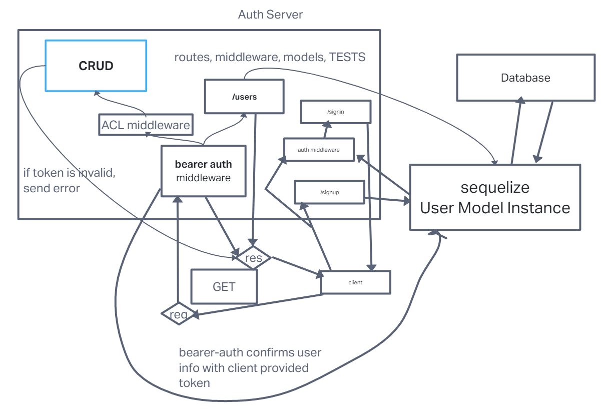

# LAB - 08

## Project: auth-api

### Author: Ike Steoger

### Problem Domain

This is a basic server with basic authentication, both `basicAuth` and `bearerAuth`.

### Links and Resources

- [GitHub Actions ci/cd](https://github.com/IkeSteoger/auth-api/actions)
<!-- - [back-end dev server url]() -->
- [back-end prod server url]()

### Collaborators

Started with CodeFellows starter code!  
Reece Renninger

### Setup

#### `.env` requirements (where applicable)

See the `.env.sample`

#### How to initialize/run your application (where applicable)

Clone repo, `npm i`, set up DB with `npm run db:config` & then `npm run db:create` then run `nodemon` in the terminal

#### Routes

- GET : `/` - server is live route
- POST: `/signup` - sign up with username & password
- POST: `signin` - sign in with username & password
- GET : `/api/v1/model` - get all model in DB
- GET : `/api/v1/model/:id` - get specific model item by ID in DB
- POST : `/api/v1/model` - add new model item to DB
- PUT : `/api/v1/model/:id` - update model item by ID in DB
- DELETE : `/api/v1/model/:id` - delete model item by ID in DB
- GET : `/api/v2/model` - get all model in DB but requires `BasicAuth`
- GET : `/api/v2/model/:id` - get specific model item by ID in DB but requires `BasicAuth`
- POST : `/api/v2/model` - add new model item to DB but requires `BearerAuth` and proper `ACL` role
- PUT : `/api/v2/model/:id` - update model item by ID in DB but requires `BearerAuth` and proper `ACL` role
- DELETE : `/api/v2/model/:id` - delete model item by ID in DB but requires `BearerAuth` and proper `ACL` role

#### Tests

To run tests, after running `npm i`, run the command `npm test`

#### UML

